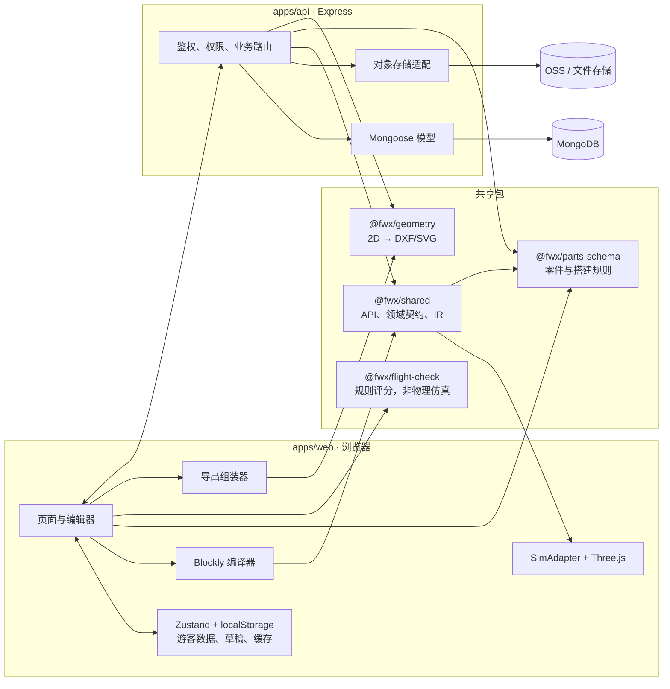
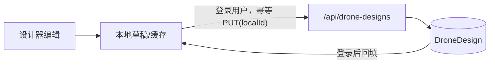
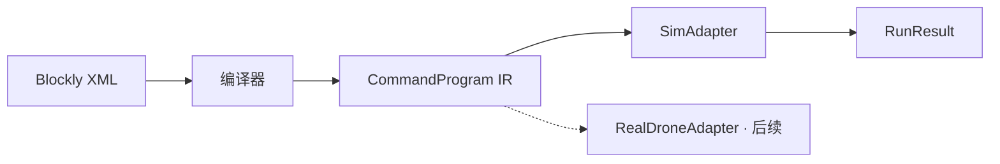
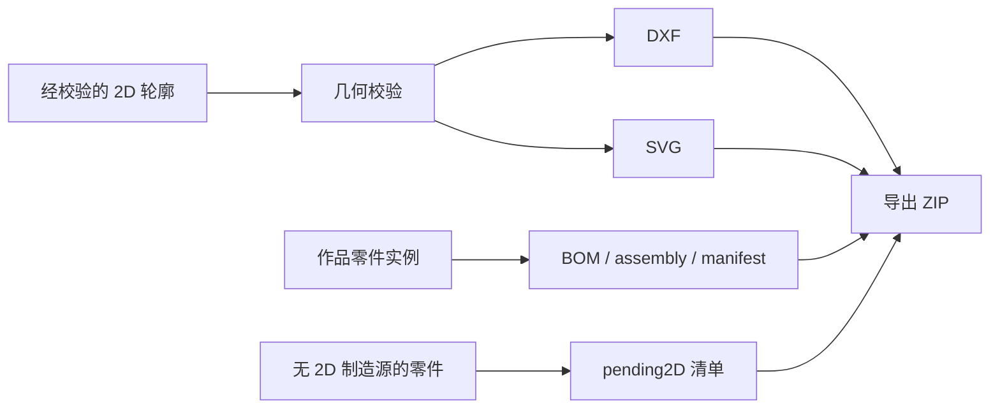

# FlightWoodX 当前架构

> 状态：当前架构说明
>
> 更新时间：2026-09-08（本次仅补前端发布边界；具体功能进度见 CURRENT_STATUS.md）
>
> 本轮结构基线：`6d0f17c`
>
> 适用范围：本仓库当前运行时模块、依赖方向、正式数据来源与主要数据流
>
> 替代关系：覆盖历史审计、路线图和旧 RFC 对“当前架构”的描述；不替代 `AGENTS.md` 的治理规则或已批准 RFC 的目标决策
>
> 规则：工程边界以 `AGENTS.md` 为准；完成情况以 `CURRENT_STATUS.md` 为准。

## 1. 核心目标

平台的最小主线是：

```text
绘制或选择零件 → 拼装无人机 → 编写飞行程序 → 视觉仿真 → 保存作品 → 导出已有数据
```

下一阶段的主功能按依赖顺序固定为两段：先把零件工坊补成可验证的二维零件来源，再让拼装器稳定消费官方零件和用户零件。编程、视觉仿真、作品管理、社区、赛事和后台都围绕同一个 `DroneDesign`，不得各自复制一份作品数据。

这条主线分为两个互相解耦的领域：

- 机体领域：零件、连接、二维几何、制造数据和结构规则。
- 飞行程序领域：Blockly、`CommandProgram` IR、模拟器和后续真机适配器。

机体是否具备真实飞行条件，不属于 IR；程序能运行，也不代表实物安全或可飞。

## 2. 运行时组件



## 3. 仓库结构

```text
AGENTS.md          仓库规则地图
.agents/skills/
  flightwoodx-development/  项目开发工作流
apps/
  web/              React、Vite、页面、编辑器、3D、浏览器缓存
  api/              Express、鉴权、领域路由、Mongoose、存储适配
  */AGENTS.md       应用就近规则
packages/
  shared/           跨端契约、角色规则、CommandProgram/DroneAdapter
  parts-schema/     零件、搭建步骤、用户零件结构
  geometry/         二维几何校验和 DXF/SVG 转换
  flight-check/     当前结构/重量/对称/动力规则评分
  AGENTS.md         共享包就近规则
docs/
  index.md          文档入口与事实地图
  product-specs/    当前产品规格
  quality/          Harness、安全、可靠性、质量与技术债
  exec-plans/       复杂任务的活动计划与完成记录
  rfcs/             目标设计与决策记录，不代表已完成
scripts/
  check-harness.mjs 可执行的知识与架构边界检查
deploy/             国内部署骨架和运维脚本
```

应用可以依赖共享包；共享包不能依赖应用。当前共享包内部只有 `@fwx/shared → @fwx/parts-schema` 这一条工作区依赖。跨应用的数据形状必须来自共享包并在运行时校验。

## 4. 主要数据流

### 4.1 作品设计



- 登录用户的正式作品来源是服务端 `DroneDesign`。
- `localId` 是客户端稳定幂等键；API 对外统一返回字符串 `id`。
- 服务端已使用共享、带版本的 `DroneDesignSnapshotSchema` 校验写入，客户端也会拒绝坏快照。Mongo 仍以 `Mixed` 保存完整快照，但它不再是无校验的 API 边界。
- 保存失败会显式反馈并保留本地内容。当前仍混合“本地主工作区”和“服务器真相源”两种语义；多设备同时修改的冲突策略尚未闭环，不应继续增加第三种同步方式。

零件工坊与拼装器的边界：

- 零件工坊负责产生经过共享契约和服务端基础几何复核的用户零件；尚未验证的制造字段必须保持未通过。
- 拼装器只保存零件实例、位置、旋转、缩放和连接关系，不复制零件源几何或硬件结论。
- 官方零件元数据来自 registry；用户零件来自正式 `CustomPart` 记录。自制零件现由 `features/partStudio/customAssembly.ts` 校验来源、版本、归属与几何，进入自由拼装；作品只存 `source` 引用，不复制源几何。主机身、起落架、保护板、连接/装饰件均支持，电子件和自动连接仍不允许。
- 工坊编辑器的毫米图形及撤销历史属于本地编辑状态：`sketch/model.ts` 先合并实体再扣除孔槽，生成单一 `Part2D`；`buildUserPartDef.ts` 平移到局部毫米原点并沿用v2契约。圆/矩形参考范围只约束尺寸，不代替板材标定或制造验证；参数化编辑历史不保存到云端。
- 预览、自由拼装与封面复用 `buildCustomGeometry`，按毫米→米生成真实2mm板厚；相机适配显示范围而不缩放几何。官方与自制件共用木纹材质工厂。服务端和显示端复用共享严格SVG解析与范围/复杂度检查；失败不删除原记录或替换来源。

混合期收敛规则（目标规则，当前尚未全部实现）：

- 登录后，有服务端 `id` 或已同步 `localId` 的作品以服务端版本为正式记录；未同步本地草稿保留为独立待认领草稿，不静默覆盖服务端记录。
- 每次同步沿用稳定 `localId` 幂等 upsert；服务端确认后写回字符串 `id`、版本和更新时间。网络或校验失败时保留待同步草稿并向用户显示失败，不伪装成已保存。
- 本地与服务端都在上次同步后发生修改时进入显式冲突状态；在契约和交互获批前，不自动按时间覆盖，也不自动合并结构数据。
- 迁移必须可重跑、可对账、可回滚；同一 `localId` 出现多条服务端记录时停止迁移并人工处理。

### 4.2 编程与仿真



- Blockly 不直接调用 Three.js 或硬件。
- 适配器只消费 IR；设备差异留在各适配器中。
- 程序正式来源是服务端 `Program`，作品通过 `programId` 绑定。
- 客户端程序草稿已按 `designId` 隔离；编程页通过 `DroneDesign.localId` 找到服务器作品，读取或写回其 `programId`。模拟器只运行当前作品程序，正式路径不再静默运行 DEMO。
- 收敛时先为作品建立或选择已绑定的 `Program`，再编译和运行；全局程序与 DEMO 只能保留在明确标识的示例入口，不能作为正式作品的静默回退。旧的未绑定程序需由用户选择归属或保持未绑定，不能自动挂到最近作品。
- 当前 `RunResult` 是适配器在客户端产生的临时结果，没有正式持久化来源。需要历史运行记录时，必须先定义服务端契约，并同时绑定 `designId`、`programId`、IR/适配器版本、规则版本和时间；在此之前不能把本地结果当作审核或评分依据。

### 4.3 二维几何与导出



- `@fwx/geometry` 只处理已有二维轮廓。
- 当前官方零件只有 3D 资产，没有完整二维制造源；它们进入 `pending2D`。
- 服务端备用导出只读取当前登录用户自己的服务端 `DroneDesign`、服务端作者和 API 自有的 `CAD_PARTS_DIR`；客户端提交的作者、统计和检查结果不进入 ZIP。默认目录当前没有获批 DXF，因此仍会把缺件写入 `MISSING_PARTS.txt`，不能作为完整导出来源。
- 自制零件写入前已由服务端复核 SVG 基础几何，并强制未完成验证的 `manufacturability.passed=false`。切割软件人工导入、材料、公差、卡扣和强度验证仍是发布阻断项。

### 4.4 社区、赛事与兼容桥

`DroneDesign` 是新作品来源；社区和赛事的存量关系仍通过 `Project` 连接 `CommunityPost`、`Submission`、`Program` 与设计。`Project` 因此是迁移期桥接，不是新功能的数据中心。

任何迁移都必须保持：

- 旧链接和公开作品可读。
- owner、visibility、reusable 与 fork 来源不丢失。
- 可回滚，并能对账迁移前后数量与引用完整性。
- 普通用户举报只创建 `Report`，不能直接改变内容审核状态；审核状态只允许管理员修改。
- fork 来源由服务端记录，同一用户对同一来源重复 fork 必须幂等返回已有作品。

## 5. 领域所有权

| 领域 | 正式数据 | 规则归属 | 当前备注 |
|---|---|---|---|
| 身份与角色 | User/JWT | API + `@fwx/shared` RBAC | 服务端最终判权 |
| 作品 | DroneDesign | API + 版本化共享契约 | 多设备冲突策略待完成 |
| 程序 | Program | `CommandProgram` + API | 已按作品隔离并绑定 |
| 官方零件 | parts registry | `@fwx/parts-schema` | 3D 资产不等于制造源 |
| 用户零件 | UserPart/CustomPart | `@fwx/parts-schema` + API | 五项制造检查未完成 |
| 仿真 | 客户端临时 `RunResult`；暂无正式持久化来源 | Adapter 契约 | 不可作为审核、评分或实飞证据 |
| 社区 | CommunityPost 等 | API | 依赖 Project 兼容桥 |
| 赛事 | Competition/Submission/Score | API 状态机 | 自动化覆盖不足 |
| 文件 | OSS/文件存储 | API 存储适配 | 数据库只存 URL |

## 6. 横切边界

### API

客户端只通过 `/api` 访问正式数据。API 负责身份、资源归属、输入校验、幂等、状态机与错误边界。`createApp` 组装应用，`server.js` 只负责配置、数据库连接和监听，便于无端口测试。列表统一分页；对象存储用于大文件。

现有部分路由仍直接承载业务和数据访问，尚未完全达到“路由只做 HTTP 转换”的目标分层。新增或修改相关功能时按领域逐步提取服务与适配器，不能把当前耦合当作推荐结构。

### 安全

Helmet、CORS、全局与敏感操作限流、数据库健康检查、JWT 会话版本撤销、上传边界、存储清理和危险清库保护已经接入。它们只是基础线；真实 MongoDB/对象存储凭证路径、公开状态、审核和未成年人信息仍需在目标环境验证。

### 性能

页面已按路由懒加载，启动不再预取全部零件 GLB，也不再依赖 Draco CDN。首页启动 `index` 为 369.82 kB（gzip 113.55 kB）；Three 相关代码按需拆为 350.12 kB 与 375.32 kB 两个块；`CodingPage` 为 724.48 kB（gzip 192.34 kB），仍触发大于 500 kB 的提示。CSS 为 546.89 kB（gzip 226.36 kB），主要体积来自 MiSans 字体。后续重点是拆分编程页并优化字体交付。

### 可观测性

API 当前记录方法、路径、状态码和耗时，并提供数据库感知健康检查。尚无结构化日志、错误聚合、指标、追踪和告警的完整闭环。

## 7. 工程 Harness

项目把代理需要的上下文和反馈回路保存在仓库内：

- 根 `AGENTS.md` 只给出读取顺序、冻结边界和完成标准；应用与共享包的细节由就近 `AGENTS.md` 补充。
- `docs/index.md` 是知识入口，产品事实、质量门槛、执行计划和历史 RFC 分开维护。
- `.agents/skills/flightwoodx-development/` 引导代理完成事实读取、任务拆解、测试先行、真实验证和状态同步，但不承担规则强制。
- `pnpm run harness` 机械检查必需文档、关键链接、根规则体积、应用与共享包的依赖方向、API 源码语言边界和仓库 Skill 白名单；源码引用使用 TypeScript compiler AST，TypeScript/Vite 配置按当前工具链解析，样式与 Vite HTML 入口使用有范围的静态扫描；CI 把它作为独立门禁执行。
- 测试、构建、浏览器、真实数据库与对象存储仍提供最终反馈。结构检查通过不能替代产品路径、外部服务、飞行或制造验证。

当前 Harness 已覆盖仓库结构，以及清单依赖与入口、直接源码引用、常用 Node 文件路径、Vite glob/配置、样式与 HTML 本地入口和仓库符号链接等受支持边界；它不是完整的跨程序文件系统、数据流、Vite 插件或 CSS/HTML 语义分析。固定浏览器 E2E、结构化日志、指标、追踪、目标环境 smoke 与周期性文档清理仍是待补反馈回路。

### 前端发布边界（2026-09-08 补充）

日常前端发布使用受保护的 `production` 分支和 `ecs-production` 环境。GitHub 的 8 项检查包含现有固定浏览器 E2E 与 API 容器 smoke；浏览器验证后的同一构建携带提交 SHA 和逐文件摘要，经专用受限 SSH 账号发送至现有 ECS。服务器 root-owned 固定发布器校验全新候选，只切换 nginx，保留旧目录并在验证失败时回退；API、Mongo、上传卷、证书和发布器自身不由前端归档升级。2026-09-08 已完成首次安装、真实权限限制、自动发布、受控回退和恢复验收；故障自动补偿只在隔离测试中验证，不等于正式站故障演练。操作与剩余限制见 [`deploy/automation/README.md`](deploy/automation/README.md) 和 [`CURRENT_STATUS.md`](CURRENT_STATUS.md)。上述 E2E 和容器 smoke 已补齐，不沿用本节早期基线的待补结论；完整监控仍未建立。

## 8. 已知架构收敛项

1. 冻结起落架唯一装配规则，消除 `parts-schema` 的 4–8 个与 `flight-check` 的恰好 4 个之间的冲突，再用共享来源和同一组 fixture 约束所有消费者。
2. 为本地草稿与服务器 `DroneDesign` 补多设备冲突协议、版本比较和恢复交互；逐步收紧 Mongo `Mixed` 存储。
3. 消除 web 内剩余的 API/领域 DTO，统一使用共享契约。
4. 完成 DroneDesign 单一来源迁移，逐步退休 Project 作品语义。
5. 建立获批的硬件、二维制造源和实飞证据；在此之前不开放结论型飞行或制造承诺。
6. 为社区、赛事、Admin 成员/学生管理补系统级 API/E2E、状态机与未成年人合规验证。
7. 在真实 MongoDB/对象存储环境完成 smoke，并建立监控、备份和恢复演练。
8. 继续拆分 `CodingPage`，优化 MiSans 字体交付。

这些是当前债务，不是允许新代码继续复制的模式。
